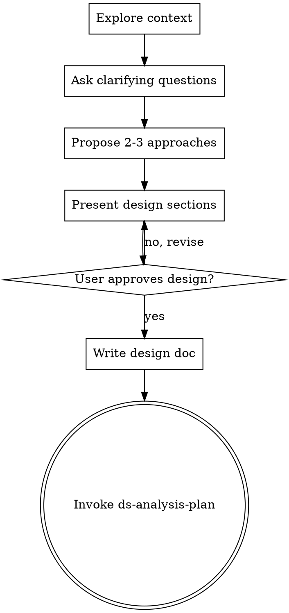

# DS Brainstorming

## Overview

Explore the analytical problem before opening a notebook. The goal is to turn a vague research request into a design with explicit units, metrics, assumptions, and success criteria.

<HARD-GATE>
Do NOT start SQL, pandas, notebook editing, metric computation, or statistical interpretation until you have presented a design and the user has approved it.
</HARD-GATE>

Do not start SQL, pandas, or notebook work until the design is explicit enough to hand off to `ds-analysis-plan` or `ds-experiment-design`.

## Anti-Pattern: "This Is Too Exploratory To Need Design"

Exploratory analysis still needs a design. The design can be short, but it must make the hypothesis, unit, metrics, and robustness checks explicit before execution.

## Checklist

You MUST complete these in order:

1. Explore project context
2. Ask clarifying questions one at a time
3. Propose 2-3 approaches
4. Present design sections and get approval
5. Write design doc
6. Transition to `ds-analysis-plan`

## Process

1. Inspect existing context: notebooks, queries, prior memos, metric definitions
2. Ask clarifying questions one at a time
3. Propose 2 or 3 analytical approaches with tradeoffs
4. Recommend one approach and explain the main risks
5. Write the agreed design and hand off to `ds-analysis-plan`

## Cover These Topics

- Business question and decision to support
- Randomization and analysis unit
- Metric hierarchy: primary, secondary, guardrails, invariants
- Time window, exclusions, and known confounders
- Required robustness checks

## After the Design

**Documentation:**
- Write the validated design to `docs/plans/YYYY-MM-DD-<topic>-design.md`
- Present it to the user

**Implementation handoff:**
- Invoke `ds-analysis-plan`
- Do not jump directly to execution skills

## Key Principles

- One question at a time
- Explore 2-3 approaches before settling
- Present tradeoffs explicitly
- Validate incrementally with the user
- Start from the decision, not from available tables

## Common Mistakes

- Starting with available tables instead of the decision
- Treating exploratory work as if the inference plan were already fixed
- Skipping contamination or interference risks
