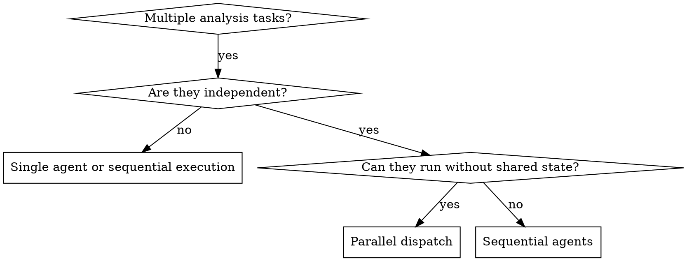

# DS Dispatching Parallel Agents

## Overview

Independent analytical tasks should not wait on each other. Dispatch one agent per independent analytical domain when concurrency speeds up the work and does not create conflicting notebook state or overlapping edits.

**Core principle:** Dispatch one agent per independent analytical domain. Let them work concurrently.

## When to Use

Use when:

- Multiple extracts can run against different tables or notebooks
- Several metric validations are independent across metrics or segments
- Robustness checks are read-only and do not depend on each other
- One task can execute while another reviews methodology or reproducibility
- Parallel work can produce separate artifacts without shared state

Do not use when:

- Tasks edit the same notebook or the same SQL file section
- One result determines the next task
- Agents would overwrite the same output table, CSV, or memo
- Shared hidden notebook state would make reruns unreliable

## The Rule

Parallelize by analytical domain, not by convenience.

Each parallel agent must have:

- One self-contained task
- A disjoint write scope or read-only scope
- Clear expected artifact
- Clear verification rule

## The Pattern

### 1. Identify Independent Domains

Group tasks by what is actually independent:
- Separate SQL extracts
- Separate metric validations
- Separate robustness checks
- Review sidecars that can run while execution continues

### 2. Create Focused Agent Tasks

Each agent gets:
- Specific scope
- Clear analytical goal
- Explicit write constraints
- Expected artifact

### 3. Dispatch in Parallel

Launch one agent per independent domain.

### 4. Review and Integrate

When agents return:
- Read each summary
- Check for conflicts
- Verify artifacts independently
- Integrate only after all parallel branches are understood

## Good DS Parallel Patterns

- Agent 1: Build baseline extract
- Agent 2: Check SRM and invariants
- Agent 3: Validate primary metric tails and denominator drift

- Agent 1: Run pre-period CUPED covariate validation
- Agent 2: Run linearization sensitivity check
- Agent 3: Review notebook reproducibility

- Agent 1: Prepare SQL extract
- Agent 2: Draft methodology memo from existing outputs
- Agent 3: Review design assumptions

## Bad Parallel Patterns

- Two agents editing the same notebook
- Two agents writing the same result table
- Parallelizing slices that depend on the primary metric definition not being finalized
- Parallelizing debugging before the first broken transformation is located

## Dispatch Template

Each agent prompt should specify:

- Analytical question
- Exact files or notebooks in scope
- Allowed write scope
- Required output artifact
- Required verification evidence
- Forbidden shortcuts

## Common Mistakes

- Too broad: "analyze everything"
- No explicit write constraints
- Parallelizing before the primary metric definition is stable
- Trusting agent summaries without checking artifacts

## When NOT to Use

- Tasks are related and one result may fix or redefine another
- Understanding requires full notebook context
- The task is still exploratory and not decomposed yet
- Agents would touch the same notebook cells or output table

## Key Benefits

1. Parallelization
2. Narrower agent focus
3. Faster turnaround on independent checks
4. Earlier visibility into multiple risks

## Verification

After agents return:
1. Review each summary
2. Check for write-scope conflicts
3. Verify artifacts independently
4. Re-run final combined verification if needed

## Integration

- Use from `ds-analysis-plan` when marking tasks that can run concurrently
- Use from `ds-subagent-driven-analysis` to split independent tasks in the current session
- Use from `ds-executing-plans` when a later batch contains parallel-safe tasks
- Do not bypass `ds-verification-before-completion` after parallel work finishes
