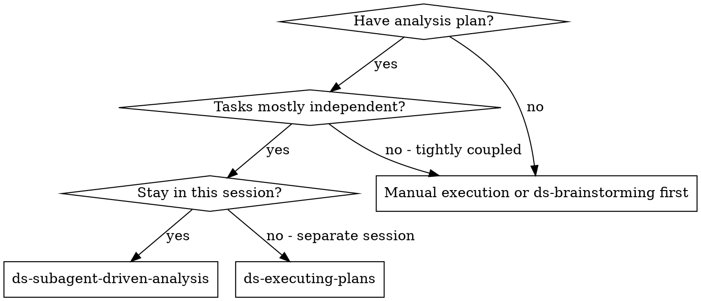
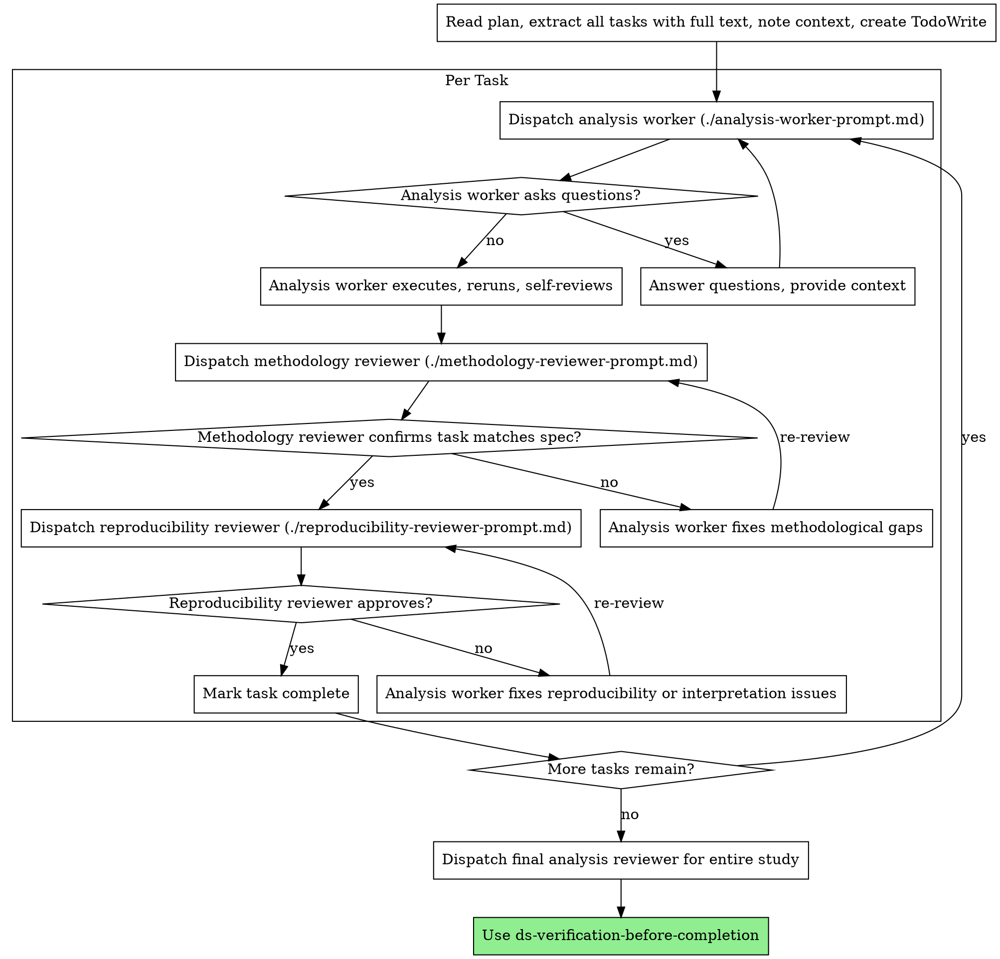

# DS Subagent-Driven Analysis

Execute plan by dispatching a fresh subagent per task, with two-stage review after each: methodology compliance review first, then reproducibility and interpretation review.

For notebook projects, the default expectation is still a self-contained notebook. Workers should not create extra helper modules for one-off analytical logic unless the task explicitly justifies that dependency.

Workers must preserve runtime observability from the plan. Long loops, chunked jobs, and SQL-heavy steps should not run silently; default to `tqdm` for iterable work and add visible status or timing output elsewhere.

**Core principle:** Fresh subagent per task + two-stage review (methodology then reproducibility/interpretation) = high quality, fast iteration

**Use after:** `ds-analysis-plan`

**Use instead of:** `ds-executing-plans` when you want to stay in the same session and keep iteration fast

If the current step contains 2 or more independent tasks with disjoint scope, combine this skill with `ds-dispatching-parallel-agents`.

## When to Use



**vs. DS Executing Plans:**
- Same session
- Fresh subagent per task
- Two-stage review after each task: methodology first, then reproducibility and interpretation
- Faster iteration without waiting for human review after every task

## Per-Task Flow



## Prompt Templates

- `./analysis-worker-prompt.md` - Dispatch analysis worker subagent
- `./methodology-reviewer-prompt.md` - Dispatch methodology compliance reviewer subagent
- `./reproducibility-reviewer-prompt.md` - Dispatch reproducibility and interpretation reviewer subagent

## Example Workflow

```
You: I'm using DS Subagent-Driven Analysis to execute this plan.

[Read plan file once]
[Extract all tasks with full text and context]
[Create TodoWrite with all tasks]

Task 1: Build assignment-quality baseline extract

[Dispatch analysis worker with full task text + context]

Worker: "Before I begin - should assignment quality be checked at client or pseudo-session level?"

You: "Client is the randomization unit. Pseudo-session can be used only as a diagnostic slice."

Worker:
  - Built baseline extract
  - Reran SQL and notebook cells
  - Produced assignment coverage table and daily counts
  - Self-review: Found one filter mismatch, fixed it

[Dispatch methodology reviewer]
Methodology reviewer: ❌ Issues:
  - Missing invariant check for country mix
  - Extra slice presented as if primary

[Worker fixes issues]

[Methodology reviewer re-reviews]
Methodology reviewer: ✅ Methodology compliant

[Dispatch reproducibility reviewer]
Reproducibility reviewer: Important issue:
  - Final notebook cell uses stale cached extract path

[Worker fixes notebook parameter]

[Reproducibility reviewer re-reviews]
Reproducibility reviewer: ✅ Approved

[Mark task complete]
```

## Parallel Case

When several tasks are truly independent:

1. Confirm disjoint write scope and no shared notebook state
2. Dispatch one worker per task through `ds-dispatching-parallel-agents`
3. Review each result separately
4. Integrate only after all artifacts and verifications are in hand

## Reviewer Focus

- Methodology review: unit alignment, metric correctness, statistical method, leakage, bias
- Reproducibility review: rerun stability, parameter clarity, notebook self-containment, final tables or plots, wording of conclusions, whether non-obvious analytical logic has concise explanatory comments, and whether long-running work has visible progress signals

## Advantages

**vs. Manual execution:**
- Fresh context per task
- Questions surfaced before work begins
- Review loops catch methodological drift early

**vs. DS Executing Plans:**
- Same session
- Continuous progress
- Review checkpoints happen automatically

## Integration

**Required workflow skills:**
- `ds-analysis-plan` - creates the plan this skill executes
- `ds-requesting-analysis-review` - review template for reproducibility and interpretation review
- `ds-verification-before-completion` - verify final conclusions before claiming readiness

**Subagents should use when needed:**
- `ds-systematic-debugging` - when numbers disagree or reruns drift
- `ds-metric-validation` - when metric definitions or denominators become suspect
- `ds-notebook-reproducibility` - when notebook state is fragile

**Alternative workflow:**
- `ds-executing-plans` - use for a separate execution session instead of same-session execution

**Verification model:**
- Rerun notebook or SQL steps
- Check artifacts and validation outputs
- Do not assume unit-test or `pytest` workflow
- No special git-worktree setup is required

## Red Flags

- One worker handles multiple unrelated tasks with stale context
- Review starts before the result is rerun
- Style-only comments block methodology comments, but missing comments on non-obvious analytical logic are still valid reproducibility issues
- The controller trusts a worker summary without checking artifacts
- Parallel workers edit the same notebook or output table
- Skip review loops after issues are found
- Start reproducibility review before methodology review is green
- Move to next task while either review has open issues
- A worker moves one-off notebook logic into a new `.py` helper module without explicit task justification
- A worker leaves long loops, chunked transforms, or SQL-heavy tasks without `tqdm`, status output, or any other visible progress signal
