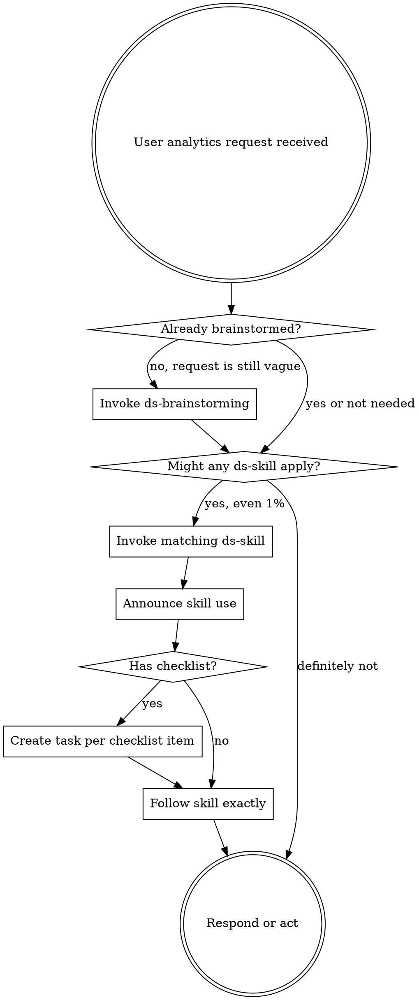

<EXTREMELY-IMPORTANT>
If there is even a small chance that a local `ds-` skill applies, invoke it before acting.

If a `ds-` skill applies to the current analytical task, you do not get to skip it because the request feels simple, urgent, or familiar.
</EXTREMELY-IMPORTANT>

# DS Using Skills

## How to Access Skills

```python

Invoke the relevant local `ds-` skill before responding or acting. Do not rely on memory alone.

## The Rule

**Invoke relevant or requested local `ds-` skills BEFORE any analytical response or action.**

- Before clarifying questions
- Before opening notebooks
- Before writing SQL
- Before interpreting results
- Before claiming completion



## Routing Table

Use this table to decide which skill to invoke automatically.

| Situation | Skill |
|----------|-------|
| Vague analytics request, unclear hypothesis, unclear unit, unclear metric hierarchy | `ds-brainstorming` |
| Planning an A/B test, A/A test, split strategy, randomization unit, guardrails, contamination risks | `ds-experiment-design` |
| Multi-step research in SQL, pandas, or notebooks needs an explicit execution plan | `ds-analysis-plan` |
| Metric definition may be leaky, unstable, denominator-sensitive, heavy-tailed, or hard to interpret | `ds-metric-validation` |
| SQL and notebook numbers disagree, row counts drift, SRM appears, joins explode, or windows look wrong | `ds-systematic-debugging` |
| Notebook trust depends on deterministic reruns, seeds, parameters, cache handling, or cell order | `ds-notebook-reproducibility` |
| A result is close to final and needs independent methodological review | `ds-requesting-analysis-review` |
| Review comments arrived and need to be evaluated rigorously rather than accepted blindly | `ds-receiving-analysis-review` |
| A written analysis plan will be executed in the same session with task-level reviews | `ds-subagent-driven-analysis` |
| A written analysis plan will be executed in a separate session with checkpoints between batches | `ds-executing-plans` |
| Two or more analysis tasks are independent and can run concurrently without shared notebook state or overlapping writes | `ds-dispatching-parallel-agents` |
| About to say a result is significant, trustworthy, complete, or decision-ready | `ds-verification-before-completion` |

## Skill Priority

When multiple `ds-` skills could apply, use this order:

1. Process first: `ds-brainstorming`, `ds-systematic-debugging`, `ds-verification-before-completion`
2. Methodology second: `ds-experiment-design`, `ds-metric-validation`, `ds-notebook-reproducibility`
3. Execution third: `ds-analysis-plan`, `ds-subagent-driven-analysis`, `ds-executing-plans`, `ds-dispatching-parallel-agents`
4. Review skills whenever conclusions or feedback are involved

## Skill Types

**Rigid:** `ds-systematic-debugging`, `ds-verification-before-completion`

Follow exactly. Do not adapt away the discipline.

**Flexible:** design, planning, review, and parallelization skills

Adapt the principles to the analytical context, but do not skip the required checkpoints.

## Red Flags

These thoughts mean stop and invoke the right skill:

| Thought | Reality |
|---------|---------|
| "I just need to open the notebook quickly" | Skill routing comes first |
| "The metric is obvious" | Denominators and leakage are rarely obvious |
| "I'll explain the result, then verify" | Verification comes before the claim |
| "The SQL mismatch is probably just a timezone issue" | Debug systematically before fixing |
| "This is exploratory, so structure is unnecessary" | Exploratory work still needs explicit assumptions |
| "I'll clean this notebook up by moving one-off helpers into a new module" | For analytical notebook projects, a self-contained notebook is usually the cleaner default |
| "I know which skill applies from memory" | Read the current skill, do not rely on memory |

## Default Flows

**New experiment or research question:**
`ds-brainstorming` → `ds-experiment-design` or `ds-analysis-plan` → execution skill, optionally `ds-dispatching-parallel-agents` for independent tasks → `ds-requesting-analysis-review` → `ds-verification-before-completion`

**Metric trouble or weird results:**
`ds-metric-validation` or `ds-systematic-debugging` → `ds-notebook-reproducibility` if reruns are fragile → `ds-verification-before-completion`

**Feedback cycle:**
`ds-requesting-analysis-review` → `ds-receiving-analysis-review` → `ds-verification-before-completion`

## User Instructions

User instructions define WHAT to analyze, validate, or conclude. They do not cancel the DS workflow that defines HOW to do it rigorously.

## DS Workflow Assumptions

- For notebook-heavy analysis, the default artifact is one self-contained notebook, not a notebook plus ad hoc helper modules
- Prefer notebook-local helper functions for one-off analytical logic; split code into separate `.py` modules only for real reuse, productionization, or a strong technical constraint
- Add minimal comments only where intent, methodology, business rules, or validation logic would otherwise be non-obvious
- Prefer one short block comment or markdown explanation over line-by-line narration
- Comment non-obvious filters, exclusions, joins or dedup logic, metric definitions, CUPED or linearization blocks, and validation cells
- Do not comment trivial pandas, SQL, or plotting operations that are already self-explanatory
- Plan and implement visible runtime progress for long-running analytical work: default to `from tqdm.auto import tqdm` for loops or chunked tasks, then add stage labels, timing, polling status, row-count checkpoints, or status cells for long SQL and heavy notebook sections
- Do not leave a human staring at a silent notebook cell or terminal while heavy analytical code is running
- Default verification uses notebook reruns, SQL reruns, validation checks, and saved analytical artifacts
- Do not assume `pytest`, unit-test style workflows, or TDD unless the user explicitly asks for software engineering work
- Do not assume any special git-worktree setup is required for notebook analysis
